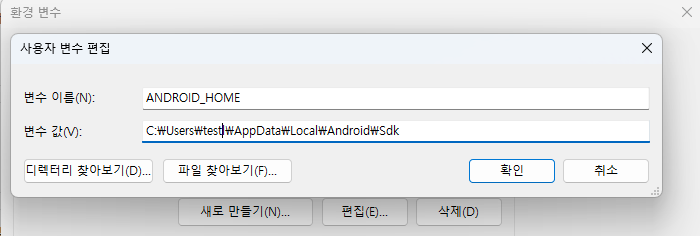
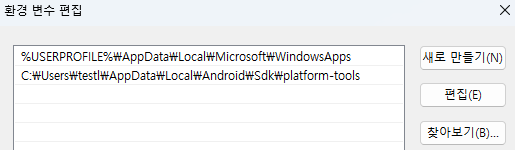
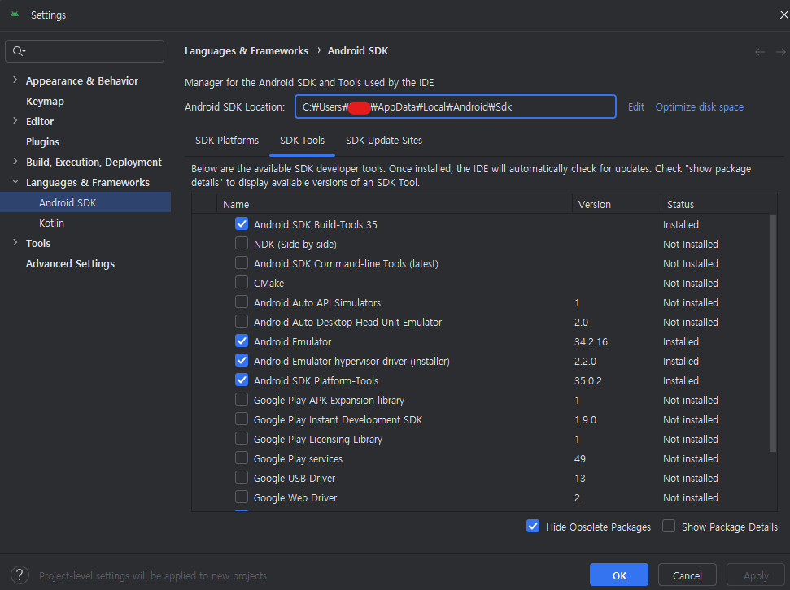
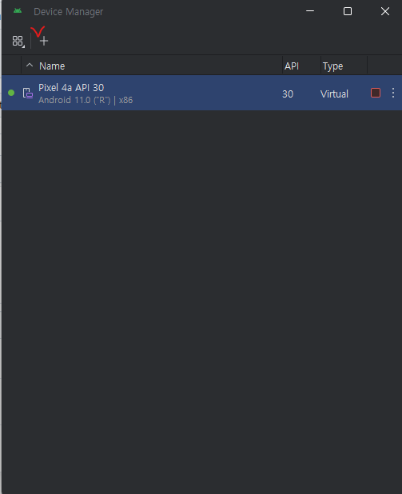
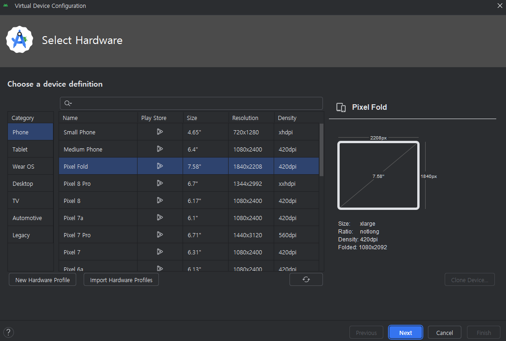

# 그누보드5 - React Native


### React Native CLI vs Expo CLI

React native를 통한 앱 개발에는 <br>
React Native 개발 프레임워크인 Expo를 이용하는 방법과<br>
React Native CLI를 이용하는 방법이 있습니다.

Expo를 활용시 초기 개발환경 구성의 용이성과 Expo 자체에서 구현해놓은 기능을 이용할 수 있는 이점 등이 있으나<br>
React Native CLI를 통해 개발하는 것이 확장성과 Native 기능 활용에 이점이 있기에<br>
그누보드5와 연동할 React Native 앱은 Expo CLI가 아닌 React Native CLI를 선택했습니다.<br>
<hr>

### Android 개발 환경 구성하기

#### Windows 운영체제

<strong>필요사항</strong>
```
- JDK
- 모바일 기기 (Emulator)
- Node
```
<br>

<h4><strong>Node, JDK</strong></h4>
   
  <a href="https://reactnative.dev/docs/set-up-your-environment">리액트 네이티브 공식 설치 가이드</a>를 보면,<br>
  Widnows - Android 개발환경 구축시 Windows 패키지 매니저 중의 하나인<br>
  Chocolatey를 통한 설치를 권장하고 있습니다.<br>
  Node, JDK를 공식 홈페이지에서 직접 설치할 수 있으며, Chocolatey를 반드시 사용하지 않아도 됩니다.<br>
  다만, 버전 선택에는 유의해야 합니다.<br>
  Node의 경우 <strong>Node 18</strong> 이상의 버전을 사용하길 권장하고 있으며,<br> 
  JDK의 경우 <strong>JDK 17</strong> 버전을 사용하길 권장하고 있습니다.<br>
  - 특히 JDK의 경우 17 이상의 버전이 아니라 17 버전을 사용하기를 권장하고 있습니다.
  - React Native 프로젝트 마다 JDK 버전이 다를 수 있습니다.
  - 그누보드5 - React Native는 현재 권장사항인 JDK17 버전으로 개발되었습니다.

<br>


<h4><strong>Android Studio</strong></h4>

Android 개발을 위해 모바일 기기가 필요하며,<br>
실제 기기 대신 Android Studio 설치를 통한 Emulator를 활용한 개발환경 구성 방법입니다.<br>
<a href="https://developer.android.com/studio">안드로이드 공식 사이트</a>에서 Android Studio를 다운로드하여 설치합니다.
<br><br>

<strong>Android Stuio 설치 후, 환경변수 설정하기</strong>

내 PC > (우클릭) 속성 > 시스템 > 고급 시스템 설정 > 고급 탭 > 환경 변수


위 경로대로 환경변수를 클릭하고, '새로 만들기'를 통해 아래와 같이 환경변수를 등록합니다.

1. ANDROID_HOME


- 변수 이름: ANDROID_HOME<br>
- 변수 값: C:\Users\\[사용자명]\AppData\Local\Android\Sdk

2. platform-tools 등록<br>
   사용자 변수에서 Path를 클릭후 편집 버튼을 누릅니다.<br>
   환경 변수 편집의 '새로 만들기'를 눌러서 아래와 같이 Path를 추가해줍니다.<br>
   C:\Users\\[사용자명]\AppData\Local\Android\Sdk\platform-tools
   

<br><br>

<strong>SDK Manager 설정하기</strong>

Android Studio 설치 및 환경변수 설정 후 SDK Manager를 실행합니다.<br>
Android Studio를 실행하여 SDK Tools 탭을 클릭후 필요한 사항을 선택하여 설치합니다.<br>
기본적으로 아래와 같은 사항들을 필수적으로 설치하는 것을 권장합니다.
```
Android SDK Build-Tools
Android Emulator
Android Emulator hypervisor driver(installer)
Android SDK Platform-Tools
```


  Intel CPU를 사용할 경우, Intel x86 Emulator Acceleator(HAXM installer)도 설치

  AMD CPU를 사용할 경우, 가상화 설정이 되어 있지 않으면 Emulator 실행이 되지 않을 수 있습니다.<br>
  가상화 설정이 필요한 경우 아래 공식 가이드를 참조하시기 바랍니다.<br>
  <a href="https://android-developers.googleblog.com/2018/07/android-emulator-amd-processor-hyper-v.html">https://android-developers.googleblog.com/2018/07/android-emulator-amd-processor-hyper-v.html</a>


SDK Platforms 탭에서 Emulator로 사용할 기기를 선택하여 설치합니다.
- 예시: Android API 35, Android 11.0("R")

<br>

<strong>Emulator 실행하기</strong><br>
  - Android Studio의 Virtual Device Manager를 통해 원하는 스펙의 emluator를 생성후 실행합니다.
  
  


<br>
<h4><strong>React Native 설치</strong></h4>

```
npm i -g react-native
```

<br>
<h4><strong>그누보드 5 - React Native 설치</strong></h4>

- repository 클론

```
git clone https://github.com/gnuboard/rn.git
```
<br>

- example.env파일을 복하여 .env 파일 생성하세요.

<br>

- dependencies 설치

```
npm install
```

<br>

- Android 실행 (emulator가 켜져 있어야 합니다.)

```
npm run android
  // 또는
npx react-native run-android
```